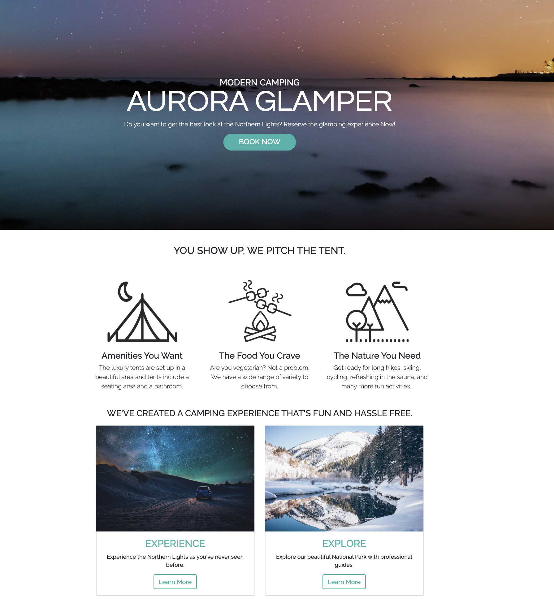

# [Aurora-Glamper](https://aurora-glamper.netlify.com/)

🏕 Fictional camping website built using Bootstrap 4.

[Deployed front-end](https://aurora-glamper.netlify.com/)

## Tech Stack

- Bootstrap
- HTML
- SASS
- Koala

## Installation

1. `git clone https://github.com/dorabelme/Aurora-Glamper.git`
2. Open `index.html` to access the site.
